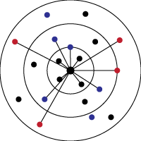

### Hello!

Welcome to my **Approximate Distance Oracle Simulation**, inspired by the paper _Thorup-Zwick Approximate Distance Oracles (2005)_. This data structure established a fundamental trade-off framework for efficiently estimating distances in a graph. [What is Graph Theory?](https://en.wikipedia.org/wiki/Graph_theory)

### Parameters

The key parameter in this Oracle is $k$, which determines the \textbf{stretch factor} of $2k - 1$. This means that the estimated distance will be at most $(2k - 1)$ times the actual shortest path distance.

### How to Use the Simulator 

To run the simulation, execute the $play$ file in _TZ_ADO/build/debug/play_ and provide the command-line arguments:

1. **k** (integer between $1$ and $5$ – Determines the stretch factor.
2. **Number of points** (any positive integer) – Higher values may slow performance.
3. **Edge density scale** $[0,1]$ – A value of $1$ creates a complete graph.

This was compiled on a Mac, so you may need to recompile it by simply running $make$ in the _TZ_ADO_ file in the command line.

### Controls

- By default, a **node is selected** at the start, with the red line showing the distances stored from that node.
- **Hover over other nodes** to see their ID and the distance estimated by the Oracle (actual distance will be added later).
- **Pivot nodes** are highlighted in **blue**, and sampled nodes are labeled with **Roman numerals** corresponding to their sample.
- To **change the center node**, right-click on any other node.
- To **view the Oracle's path to a target node**, left-click on that node. This will display the stored distance of that node and reveal where it intersects with the center node.

Here is a short demo ideo showing the simulation:

Enjoy!
